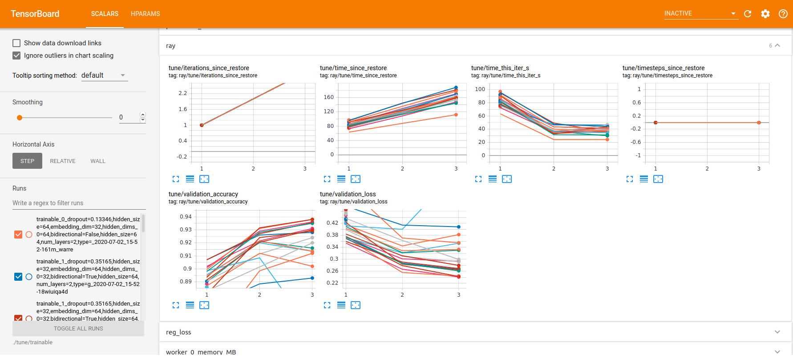
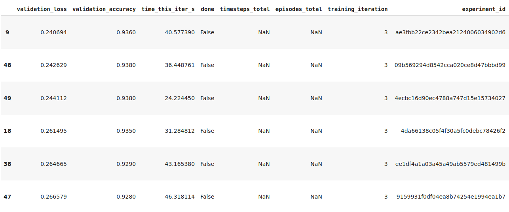
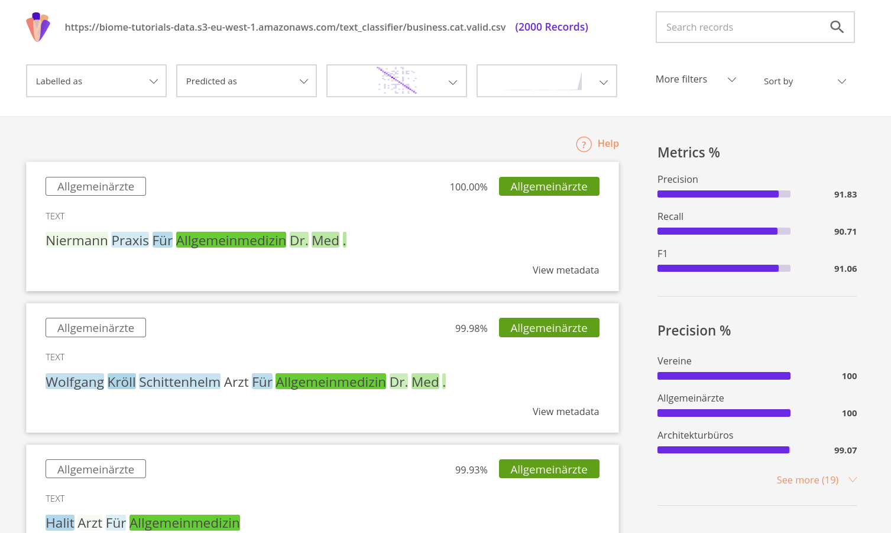

# Hyperparameter optimization with Ray Tune

<a target="_blank" href="https://www.recogn.ai/biome-text/documentation/tutorials/3-Hyperparameter_optimization_with_Ray_Tune.html"></a>
[View on recogn.ai](https://www.recogn.ai/biome-text/documentation/tutorials/3-Hyperparameter_optimization_with_Ray_Tune.html)

<a target="_blank" href="https://colab.research.google.com/github/recognai/biome-text/blob/master/docs/docs/documentation/tutorials/3-Hyperparameter_optimization_with_Ray_Tune.ipynb"></a>
[Run in Google Colab](https://colab.research.google.com/github/recognai/biome-text/blob/master/docs/docs/documentation/tutorials/3-Hyperparameter_optimization_with_Ray_Tune.ipynb)

<a target="_blank" href="https://github.com/recognai/biome-text/blob/master/docs/docs/documentation/tutorials/3-Hyperparameter_optimization_with_Ray_Tune.ipynb"></a>
[View source on GitHub](https://github.com/recognai/biome-text/blob/master/docs/docs/documentation/tutorials/3-Hyperparameter_optimization_with_Ray_Tune.ipynb)

Here we will optimize the hyperparameters of the short-text classifier from [this tutorial](https://www.recogn.ai/biome-text/documentation/tutorials/1-Training_a_text_classifier.html), hence we recommend to have a look at it first before going through this tutorial.
For the Hyper-Parameter Optimization (HPO) we rely on the awesome [Ray Tune library](https://docs.ray.io/en/latest/tune.html#tune-index).

For a short introduction to HPO with Ray Tune you can have a look at this nice [talk](https://www.youtube.com/watch?v=VX7HvEoMrsA) by Richard Liaw. 
We will follow his terminology and use the term *trial* to refer to a training run of one set of hyperparameters. 

When running this tutorial in Google Colab, make sure to install *biome.text* and *ray tune* first:


```python
!pip install -U git+https://github.com/recognai/biome-text.git
```

Ignore warnings and don't forget to restart your runtime afterwards (*Runtime -> Restart runtime*).

If you want to log your runs with [WandB](https://wandb.ai), don't forget to install its client and log in.


```python
!pip install wandb
!wandb login
```

::: tip Note

In this tutorial we will use a GPU by default.
So when running this tutorial in Google Colab, make sure that you request one (*Edit -> Notebook settings*).

:::

## Imports

First let's import all the stuff we need for this tutorial:


```python
import os
from biome.text import Pipeline, Dataset
from biome.text.configuration import VocabularyConfiguration, WordFeatures, TrainerConfiguration
from biome.text.loggers import BaseTrainLogger
from biome.text.hpo import TuneExperiment
from ray import tune
```

## Creating the datasets

As a first step we will download the training and validation data to our local machine, and create our datasets. 


```python
!curl -O https://biome-tutorials-data.s3-eu-west-1.amazonaws.com/text_classifier/business.cat.train.csv
!curl -O https://biome-tutorials-data.s3-eu-west-1.amazonaws.com/text_classifier/business.cat.valid.csv
```


```python
train_ds = Dataset.from_csv("business.cat.train.csv")
valid_ds = Dataset.from_csv("business.cat.valid.csv")
```

## Defining the pipeline and the search space

As mentioned in the introduction we will use the same pipeline configuration as used in the [base tutorial](https://www.recogn.ai/biome-text/documentation/tutorials/1-Training_a_text_classifier.html)).

To perform a random hyperparameter search (as well as a grid search) we simply have to replace the parameters we want to optimize with methods from the [Random Distributions API](https://docs.ray.io/en/latest/tune/api_docs/search_space.html#random-distributions-api) or the [Grid Search API](https://docs.ray.io/en/latest/tune/api_docs/search_space.html#grid-search-api) in our configuration dictionaries.
For a complete description of both APIs and how they interplay with each other, see the corresponding section in the [Ray Tune docs](https://docs.ray.io/en/latest/tune/api_docs/search_space.html). 

In our case we will tune 9 parameters:
- the output dimensions of our `word` and `char` features
- the dropout of our `char` feature
- the architecture of our pooler (*GRU* versus *LSTM*)
- number of layers and hidden size of our pooler, as well as if it should be bidirectional
- hidden dimension of our feed forward network
- and the learning rate

For most of the parameters we will provide discrete values from which Tune will sample randomly, while for the dropout and learning rate we will provide a continuous linear and logarithmic range, respectively.
Since we want to directly compare the outcome of the optimization with the base configuration of the [underlying tutorial](https://www.recogn.ai/biome-text/documentation/tutorials/1-Training_a_text_classifier.html), we will fix the number of epochs to 3.

Not all of the parameters above are worth tuning, but we want to stress the flexibility that *Ray Tune* and *biome.text* offers you.

::: tip Tip

Keep in mind that the learning rate "*is often the single most important hyper-parameter and one should always make sure that it has been tuned (up to approximately a factor of 2). ... If there is only time to optimize one hyper-parameter and one uses stochastic gradient descent, then this is the hyper-parameter that is worth tuning.*" ([Yoshua Bengio](https://arxiv.org/abs/1206.5533)).

:::

In the following configuration dictionaries we replaced the relevant parameters with tune's search spaces.


```python
# defining the search spaces in our pipeline config
pipeline_config = {
    "name": "german_business_names",
    "tokenizer": {
        "text_cleaning": {
            "rules": ["strip_spaces"]
        }
    },
    "features": {
        "word": {
            "embedding_dim": tune.choice([32, 64]),
            "lowercase_tokens": True,
        },
        "char": {
            "embedding_dim": 32,
            "lowercase_characters": True,
            "encoder": {
                "type": "gru",
                "num_layers": 1,
                "hidden_size": tune.choice([32, 64]),
                "bidirectional": True,
            },
            "dropout": tune.uniform(0, 0.5),
        },
    },
    "head": {
        "type": "TextClassification",
        "labels": list(set(train_ds["label"])),
        "pooler": {
            "type": tune.choice(["gru", "lstm"]),
            "num_layers": tune.choice([1, 2]),
            "hidden_size": tune.choice([32, 64]),
            "bidirectional": tune.choice([True, False]),
        },
        "feedforward": {
            "num_layers": 1,
            "hidden_dims": tune.choice([32, 64]),
            "activations": ["relu"],
            "dropout": [0.0],
        },
    },       
}

# defining the search spaces in our trainer config
trainer_config = {
    "optimizer": {
        "type": "adam",
        "lr": tune.loguniform(0.001, 0.01)
    },
    "num_epochs": 3
}
```

::: tip Note

By default we will use a GPU if available.
If you do not want to use your GPU, just specify `"cuda_device": -1` in your `trainer_config` above.

:::

## Starting the random search

Before starting our random hyperparameter search we first have to create a `TuneExperiment` instance with our configurations dicts and our datasets.
We also set a name that will mainly be used as project and experiment name for the integrated WandB and MLFlow logger, respectively.

Furthermore, we can pass on all the parameters available for the underlying [`tune.Experiment`](https://docs.ray.io/en/master/tune/api_docs/execution.html#tune-experiment) class:

- The number of trials our search will go through depends on the `num_samples` parameter.
In our case, a random search, it equals the number of trials, whereas in the case of a grid search the total number of trials is `num_samples` times the grid configurations (see the [Tune docs](https://docs.ray.io/en/latest/tune/api_docs/search_space.html#overview) for illustrative examples).

- The `local_dir` parameter defines the output directory of the HPO results and will also contain the training results of each trial (that is the model weights and metrics).

- The number of parallel running trials depends on your `resources_per_trial` configuration and your local resources.
The default value is `{"cpu": 1, "gpu": 0}` and results, for example, in 8 parallel running trials on a machine with 8 CPUs.
You can also use fractional values. To share a GPU between 2 trials, for example, pass on `{"gpu": 0.5}`. 

::: tip Note

Keep in mind: to run your HPO on GPUs, you have to specify them in the `resources_per_trial` parameter when calling `tune.run()`.
If you do not want to use a GPU, just set the value to 0 `{"cpu": 1, "gpu": 0}`.

:::


```python
my_random_search = TuneExperiment(
    pipeline_config=pipeline_config,
    trainer_config=trainer_config,
    train_dataset=train_ds,
    valid_dataset=valid_ds,
    name="My first random search",
    # `tune.Experiment` kwargs:
    num_samples=50,
    local_dir="tune_runs",
    resources_per_trial={"cpu": 1, "gpu": 0.5},
)
```

With our `TuneExperiment` object at hand, we simply have to pass it on to the [`tune.run`](https://docs.ray.io/en/master/tune/api_docs/execution.html#tune-run) function to start our random search.

In this tutorial we will perform a random search together with the [Asynchronous Successive Halving Algorithm (ASHA)](https://blog.ml.cmu.edu/2018/12/12/massively-parallel-hyperparameter-optimization/) to schedule our trials.
The Ray Tune developers advocate this `scheduler` as a good starting point for its aggressive termination of low-performing trials.
You can look up the available configurations in the [ASHAScheduler docs](https://docs.ray.io/en/latest/tune/api_docs/schedulers.html#asha-tune-schedulers-ashascheduler), here we will just use the default parameters.

We also have to specify on what `metric` to optimize and its `mode` (should the metric be *minimized* (`min`) or *maximized* (`max`) ).

The `progress_reporter` is a nice feature to keep track of the progress inside a Jupyter Notebook, for example.


```python
analysis = tune.run(
    my_random_search,
    scheduler=tune.schedulers.ASHAScheduler(), 
    metric="validation_loss", 
    mode="min",
    progress_reporter=tune.JupyterNotebookReporter(overwrite=True)
)
```

### Following the progress with tensorboard (optional)

Ray Tune automatically logs its results with [TensorBoard](https://www.tensorflow.org/tensorboard/).
We can take advantage of this and launch a TensorBoard instance before starting the hyperparameter search to follow its progress.
The `RayTuneTrainable` class will also log the metrics to MLFlow and WandB, if you prefer those platforms.


```python
%load_ext tensorboard
```


```python
%tensorboard --logdir ./runs/tune
```


*Screenshot of TensorBoard*

## Checking the results

The *analysis* object returned by `tune.run` can be accessed through a *pandas DataFrame*.


```python
analysis.dataframe().sort_values("validation_loss")
```


*Screenshot of the analysis dataframe*

Event though with 50 trials we visit just a small space of our possible configurations, we should have achieved an accuracy of ~0.94, an increase of roughly 3 points compared to the original configuration of the [base tutorial](https://www.recogn.ai/biome-text/documentation/tutorials/1-Training_a_text_classifier.html).

In a real-life example, though, you probably should increase the number of epochs, since the validation loss in general seems to be decreasing further.

A next step could be to fix some of the tuned parameters to the preferred value, and tune other parameters further or limit their value space.

::: tip Tip

To obtain insights about the importance and tendencies of each hyperparameter for the model, we recommend using TensorBoard's *HPARAM* section and follow Richard Liaw's suggestions at the end of his [talk](https://www.youtube.com/watch?v=VX7HvEoMrsA).

:::

### Evaluating the best performing model

The *analysis* object also provides some convenient methods to obtain the best performing configuration, as well as the `logdir` where the results of the trial are saved.


```python
analysis.get_best_config()
```


```python
best_config = analysis.get_best_config()
best_logdir = analysis.get_best_logdir()
```

We can use the `best_logdir` to create a pipeline with the best performing model and start making predictions.


```python
best_model = os.path.join(best_logdir, "training", "model.tar.gz")
pl_trained = Pipeline.from_pretrained(best_model)
```


```python
pl_trained.predict(text="Autohaus Recognai")
```

Or we can use *biome.text*'s explore UI to evaluate the performance of our model in more detail. 

::: warning Warning

For the UI to work you need a running [Elasticsearch](https://www.elastic.co/guide/en/elasticsearch/reference/current/install-elasticsearch.html) instance.
We recommend installing [Elasticsearch with docker](https://www.elastic.co/guide/en/elasticsearch/reference/7.7/docker.html#docker-cli-run-dev-mode).

:::


```python
from biome.text import explore

explore.create(pl_trained, valid_ds, explain=True)
```


*Screenshot of the biome.text explore UI*

::: tip Note

For an unbiased evaluation of the model you should use a test dataset that was not used during the HPO!

:::

## Appendix: Custom HPO with ray tune

As seen in this tutorial, *biome.text* provides you some convenient tools to easily perform HPO in a few steps.
To take advantage of all the ray tune features, you can also define your own trainable function and follow ray tune's [function API](https://docs.ray.io/en/latest/tune/api_docs/trainable.html#tune-function-api).

Below we give a minimal example of such an approach.

### Implementing the report

A lot of features in ray tune require the trials to report some metrics during their trainings, such as trial schedulers that adaptively allocate resources as the ASHA scheduler used above.
For the reporting we can use the abstract `biome.text.loggers.BaseTrainLogger` class, that allows to make callbacks after each epoch: 


```python
class TuneReporter(BaseTrainLogger):
    def log_epoch_metrics(self, epoch, metrics):
        tune.report(
            validation_loss=metrics["validation_loss"], 
            validation_accuracy=metrics["validation_accuracy"]
        )
        
tune_reporter = TuneReport()
```

### Defining the training loop

Following the [function-based Trainable API](https://docs.ray.io/en/latest/tune/api_docs/trainable.html#tune-function-api), we now have to define a `trainable` function that takes as input a configuration dictionary and executes a training run:


```python
def trainable(config):
    pl = Pipeline.from_config(config["pipeline"])
    trainer_config = TrainerConfiguration(**config["trainer"])
    
    train_ds = DataSource(train_path)
    valid_ds = DataSource(valid_path)
    
    pl.create_vocabulary(VocabularyConfiguration(sources=[train_ds]))
    
    pl.train(
        output="output",
        training=train_ds,
        validation=valid_ds,
        trainer=trainer_config,
        loggers=[tune_report],
    )
```

In the `Pipeline.train()` method above we added our `tune_reporter` instance to the loggers in order to report the validation loss and accuracy back to tune.
Note that we did not include a MLFlow or WandB logger!

The `config` dictionary, where we define the pipeline, trainer and the hyperparameters, could look something like this:


```python
configs = {
    "pipeline": {
        "name": "german_business_names",
        "tokenizer": {
            "text_cleaning": {
                "rules": ["strip_spaces"]
            }
        },
        "features": {
            "word": {
                "embedding_dim": tune.choice([32, 64]),
                "lowercase_tokens": True,
            },
        },
        "head": {
            "type": "TextClassification",
            "labels": list(labels.value_counts().index),
            "pooler": {
                "type": tune.choice(["gru", "lstm"]),
                "num_layers": tune.choice([1, 2]),
                "hidden_size": tune.choice([32,64]),
                "bidirectional": tune.choice([True, False]),
            },
        },       
    }, 
    "trainer": {
        "optimizer": {
            "type": "adam",
            "lr": tune.loguniform(0.001, 0.01),
        },
        "num_epochs": 3,
    },
}
```

With the trainable function at hand we can now call the `tune.run` method to start our HPO.


```python
analysis = tune.run(
    trainable, 
    config=configs, 
    num_samples=1, 
)
```

For an advanced example with checkpointing, you can have a look at the colab notebook [*Population Based Training with biome.text*](https://colab.research.google.com/drive/1vmt3D_2kq6VxE2-nlwsZl0YrN3nAhHp0?usp=sharing).
